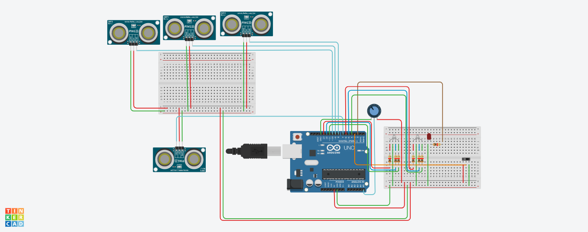

# 🚗 Automated Car Wash System  
### Arduino-Based Simulation (Tinkercad)

## 📌 Project Overview
This project presents the design and simulation of an **automated car wash system** using Arduino on Tinkercad. The system detects the presence of a vehicle and executes a predefined washing sequence based on user-selected modes.

The goal is to demonstrate **automation logic, sensor integration, and embedded system control** in a real-world industrial scenario.

---

## 🎯 Key Features
- Automated car detection using ultrasonic sensors  
- Multiple washing modes:
  - Water only  
  - Water + Soap  
  - Water + Soap + Wax  
- Sequential control of washing stations  
- Emergency stop using a main switch  
- LED-based simulation of system workflow  

---

## ⚙️ System Architecture

The system is divided into four functional stations:

- **Water Booth:** Initial cleaning using water  
- **Soap Booth:** Application of cleaning agents  
- **Soap + Wax Booth:** Final cleaning and polishing  
- **Drying Booth:** Air-based drying system  

Each station is activated automatically when a vehicle is detected within a محدد distance using proximity sensors.

---

## 🛠️ Technologies & Components

### 💻 Technologies
- Arduino (Embedded C / Arduino IDE)  
- Tinkercad Simulator  

### 🔌 Hardware Components
- Arduino Uno  
- Ultrasonic Sensors (x4)  
- RGB LEDs (x2)  
- Standard LEDs  
- Resistors  
- Sliding Switch (main control)  
- Potentiometer  
- Connecting wires  

---

## 📷 Circuit Design

---

## 🎥 Demo Video
👉 Watch the simulation:  
[https://youtu.be/FONUr4kZX1I]

---

## 💻 Code Structure
All source code is available in the `Code/` folder.

Main functionalities:
- Continuous system monitoring loop  
- Sensor-based detection logic  
- Sequential activation of stations  
- Emergency shutdown control  

---

## 🧠 Implementation Details

- The system operates using a **continuous loop** that monitors:
  - Switch state (ON/OFF)
  - Sensor inputs  

- When a vehicle is detected:
  - The corresponding station is activated  
  - LEDs simulate real-world actions  

- A **main switch** allows immediate shutdown at any stage of operation (safety feature)

---

## 🚀 Future Improvements
- Integrate temperature sensors for system safety  
- Add emergency button with buzzer alarm  
- Replace polling with interrupt-based system  
- Add LCD display for user interface  
- Mobile app or IoT integration  

---

## 🌍 Academic Context
This project is inspired by collaborative work between:
- NSIT (India)  
- URJC (Spain)  

📄 Reference paper:  
https://onlinelibrary.wiley.com/doi/abs/10.1002/cae.22250

---

## 👤 Author
**Amine Ouklilane**  
Electrical Engineering Student  

- Interested in Embedded Systems, Automation, and Smart Systems  
- Currently building projects to strengthen my engineering portfolio  

---

## 💡 Portfolio Note
This project is part of my journey to develop **real-world engineering systems** combining hardware simulation and control logic, with the goal of pursuing advanced studies and international opportunities.
